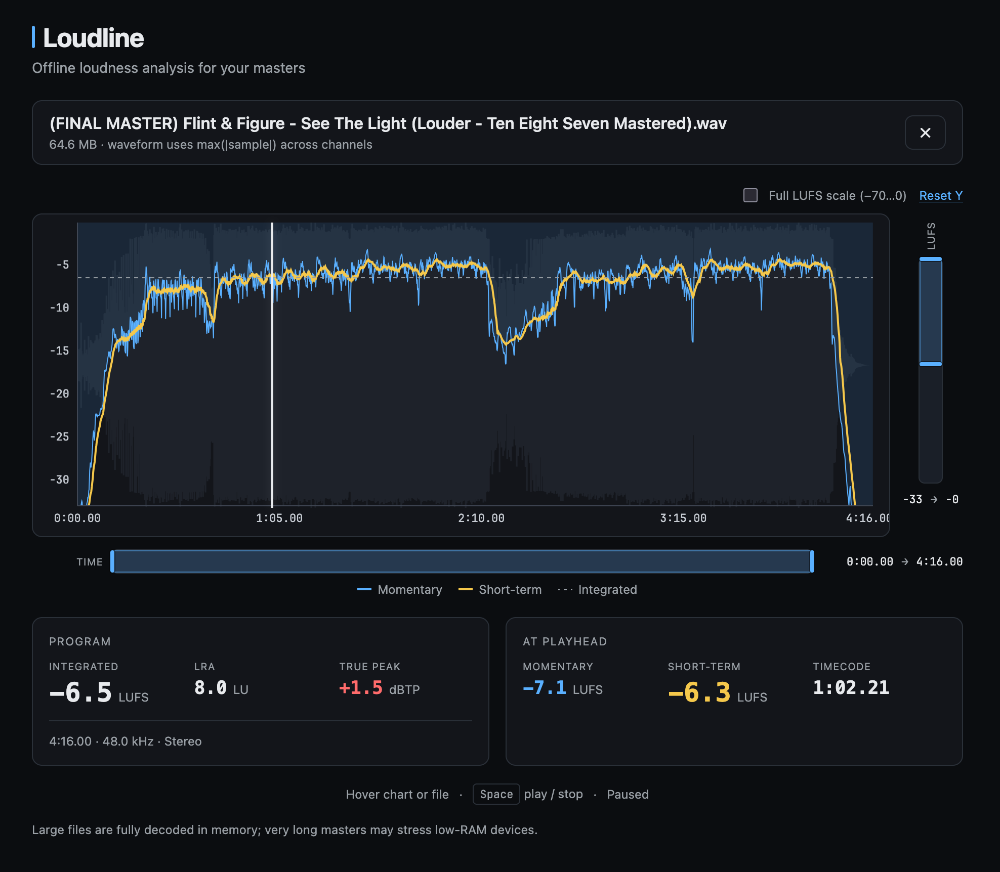

# Loudline

**Instantly analyze the loudness of your audio files before you hit play. Drop a track and get a full LUFS graph.**

[**Try it out**](https://jeroen-meijer.github.io/loudline/)

<p align="center">
  
</p>

> **AI-generated:** This app was fully coded by AI (Claude by Anthropic).

Offline EBU R128 loudness metering in the browser. Drag in an audio file and get momentary / short-term LUFS over time, integrated LUFS, LRA, max true peak, a waveform backdrop, and Space-to-preview playback. All decoding and analysis happens locally — no upload.

Live site: `https://jeroen-meijer.github.io/loudline/`

## Tech Stack

- React 19 + TypeScript + Vite
- [`loudness-worklet`](https://www.npmjs.com/package/loudness-worklet) — EBU R128 / ITU-R BS.1770-5 analysis via `AudioWorkletNode`
- Web Audio API (`OfflineAudioContext` for analysis + 48 kHz normalization, `AudioContext` for preview)
- Recharts for the loudness graph
- Bun for tooling
- GitHub Pages deployment via GitHub Actions

## Common Commands

```bash
bun install
bun run dev          # http://localhost:5173
bun run lint
bun run build        # tsc -b && vite build
bun run preview      # http://localhost:4173 (production bundle)
```

## Desktop app (Tauri)

Loudline ships as a small native wrapper around the same web UI ([Tauri 2](https://v2.tauri.app/)). Analysis still runs locally in the embedded WebView (same `loudness-worklet` path as the browser build).

**Prerequisites:** [Rust](https://rustup.rs/) (stable), plus platform tooling for [Tauri](https://v2.tauri.app/start/prerequisites/) (Xcode CLT on macOS, etc.).

```bash
bun run tauri:dev     # Vite + desktop window (hot reload)
bun run tauri:build   # Release installers in src-tauri/target/release/bundle/
```

Desktop extras: **Open file…** button, **⌘/Ctrl+O**, and drag-and-drop onto the window. Installers are produced per OS when you run `tauri:build` on that platform.

**Version:** set `package.json` → `version`, then `bun run version:sync` (or rely on `tauri:dev` / `tauri:build`, which sync automatically). Bump with `bun run version:set 0.5.0`.

## GitHub Pages

CI sets `VITE_BASE_PATH=/<repo-name>/` automatically when building. For a local production build that matches the deployed path:

```bash
VITE_BASE_PATH=/loudline/ bun run build && bun run preview
```

For root user pages (`username.github.io`) leave `VITE_BASE_PATH` unset or set it to `/`.

## CSP / worklet loading

`loudness-worklet` registers its processor via a `blob:` URL by default. If a host serves the site under a strict `Content-Security-Policy` that blocks `blob:` worklets, vendor [`loudness.worklet.js`](https://github.com/lcweden/loudness-worklet/releases) into `public/` and call `audioContext.audioWorklet.addModule('/loudness.worklet.js')` directly (see upstream README).
